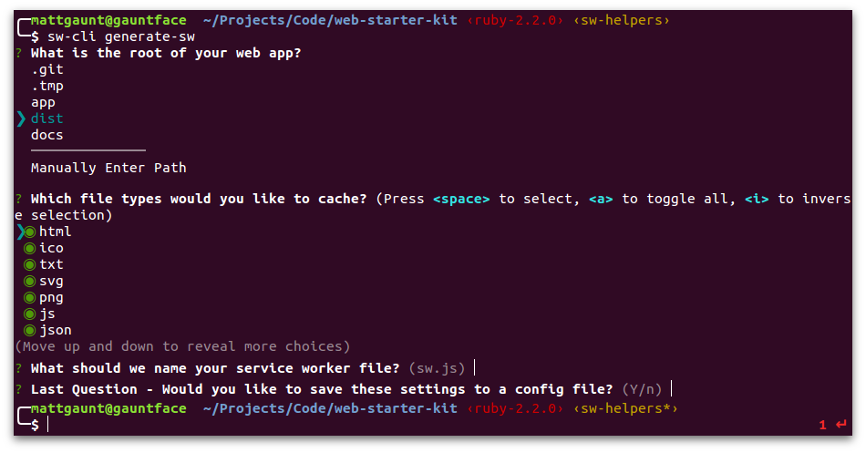

# Generate a Service Worker with workbox-cli

Get a precaching service worker in about two minutes with the `workbox-cli` module.
Simply install the module then run it from a command line.

## Install

Install the module with NPM.

```
npm install workbox-cli --global
```

## Generate a Service Worker

To generate a service worker, run `workbox-cli` with the 'generate:sw' command in the root of
your project.

```
workbox-cli generate:sw
```

This asks a range of questions about your web app, such as which directory
contains the assets for your site, and which assets you'd like to cache.



After the command runs you'll have two new files, a
`sw-lib.vX.X.X.min.js` and `sw.js` file (unless you changed
the file name).

## Create a Config File

One of the questions asked by `workbox-cli generate:sw` is whether you'd like to save
your responses to a configuration file. Answering `Y` will save your responses
to `workbox-cli-config.json`. Subsequent runs of the cli will regenerate the service
worker based on the config file, which makes building faster. 

## Using the Generated Service Worker

To use the service worker, you'll need to register your
newly generated service worker file in your web page,
which you can do like so:

```
if(navigator.serviceWorker) {
  navigator.serviceWorker.register('/sw.js')
  .catch(function(err) {
    console.error('Unable to register service worker.', err);
  });
}
```

With this, the browser will register your `sw.js` which
will preache the assets in your app and serve them
from the cache.

## What is in sw.js?

For those who are curious, let's look at what's in the
generated service worker.

```
importScripts('workbox-sw.prod.vX.Y.Z.js');

/**
 * DO NOT EDIT THE FILE MANIFEST ENTRY
 *
 * .....
 */
const fileManifest = [
  {
    "url": "/index.html",
    "revision": "b3e78d93b20c49d0c927050682c99df3"
  },
  {
    "url": "/images/hamburger.svg",
    "revision": "d2cb0dda3e8313b990e8dcf5e25d2d0f"
  },
  ....
];

const workboxSW = new self.WorkboxSW();
workboxSW.precache(fileManifest);
```

The service worker imports the `workbox-sw` file which is
a library that manages the precaching and returning
of assets when the browser requests them.

The `fileManifest` is an array of all the assets in your
web app. Each file entry consists of a URL and a revision.
This is used to download the files whenever they change.

The service worker then calls
`workboxSW.precache()` which downloads
all the assets during the service worker install event.

## What Next?

If you only need precaching and serving of assets then
you can carry on using `workbox-cli` as is.

Otherwise maybe you'll want to explore one of the following.

### Generating SW in a Build Process

If you have a build process, you might want to use the `workbox-build` module
instead of `workbox-cli`. The `workbox-build` module allows you to generate the
service worker programmatically.

[Learn more about workbox-build here](../reference-docs/latest/module-workbox-build.html)

It's also possible to use `workbox-cli` in a npm-based build process.

[Learn more about using workbox-cli with npm here](../get-started/npm-script.html)

### Precaching in Your Own Service Worker

Instead of generating a service worker, you may want some
of the features provided by `workbox-cli` but added to your
own service worker.

For this you have a few options.

Both `workbox-cli` and `workbox-build` produce a
list of assets in your web app with revision
information which can be used for precaching. 

You can then use `workbox-sw` to perform the precaching and
you can define custom routes and add anything else you
desire to your service worker.

[Learn more about workbox-sw here](../reference-docs/latest/module-workbox-sw.html)
